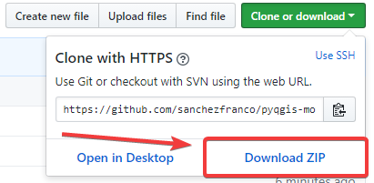
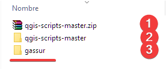
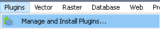
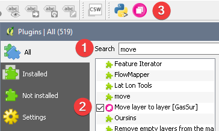

# PyQGIS Move active layer to layer plugin

## v1.0 (13-10-2017)

### Instalación

**Descargar el archivo zip**  

**Extrae el archivo zip en la carpeta de plugins de QGIS**  
  * En Windows, en uno de estos directorios: 
    `C:\Usuarios\tu_nombre_de_usuario\.qgis2\python\plugins\` 
    o bien, en:  
    `C:\Archivos de programa (x86)\QGIS 2.18\apps\qgis\python\plugins`
  * Renombra la carpeta extraída a "gassur".  
  

**Inicia QGIS y ve a `Complementos->Administra e instala complementos`** 

  

  * Busca "Move layer to layer [GasSur]" y hazle click.  

    

**Con esto, Un nuevo botón se agregará a la barra de QGIS y el plugin se encontrará listo para ser utilizado.**  

